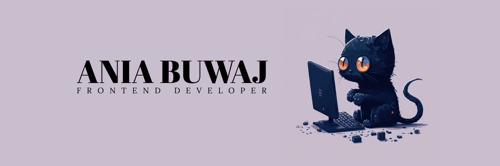

# 👋&nbsp; Hello! I'm Ania

    

    
    
    

## 📚&nbsp; About me

### 😄&nbsp;Welcome!

My name is Ania, I'm a frontend developer form Poland. I build websites. I have strong understanding of the building blocks of the web - **HTML, CSS & JavaScript** - so my projects are **responsive** and catch the user's eye with **simple yet fun effects**, which are always made to be **performant**. I also have working knowledge of **React** and am continuing to build my expertise.

So far I've completed 20 challenges from <a href="https://www.frontendmentor.io" target="_blank">Frontend Mentor</a>. You can check them out <a href="https://www.frontendmentor.io/profile/ania221B/solutions" target="_blank">here</a>.

I'm looking to get hired in IT industry, so that I can use what I already know in building projects and further expand my skillset.

### 💻&nbsp;Learning now

Currently I'm trying to reinforce what I've learnt so far about frontend development.

### 🎯&nbsp;Skills

At the moment I work as a translator. In this job I gained the following skills:

- **clear communication** - I ask precise questions and explain things in an easy to follow manner in my answers.
- **attention to detail** - I have a good eye for nuance, which lets me make sure my work is always done to the best of my ability.
- **good research skills** - I always make sure to find information and context needed to get the job done well.
- **independence at work** - I try to find solutions to problems I encounter during work before reaching out for help and asking questions.

### 😎&nbsp;Hobbies & interests

- I just love music, it makes any day better
- I enjoy a good story, told in a a book, film, TV series or else
- I like to cook and bake, event though I'm no chef

## 🛠️&nbsp;Languages & tools

    &nbsp;
    &nbsp;
    &nbsp;
    &nbsp;
    &nbsp;

&nbsp;

## 📈&nbsp;GitHub stats

<!--
**ania221B/ania221B** is a ✨ _special_ ✨ repository because its `README.md` (this file) appears on your GitHub profile.

Here are some ideas to get you started:

- 🔭 I’m currently working on ...
- 🌱 I’m currently learning ...
- 👯 I’m looking to collaborate on ...
- 🤔 I’m looking for help with ...
- 💬 Ask me about ...
- 📫 How to reach me: ...
- 😄 Pronouns: ...
- ⚡ Fun fact: ...
-->
